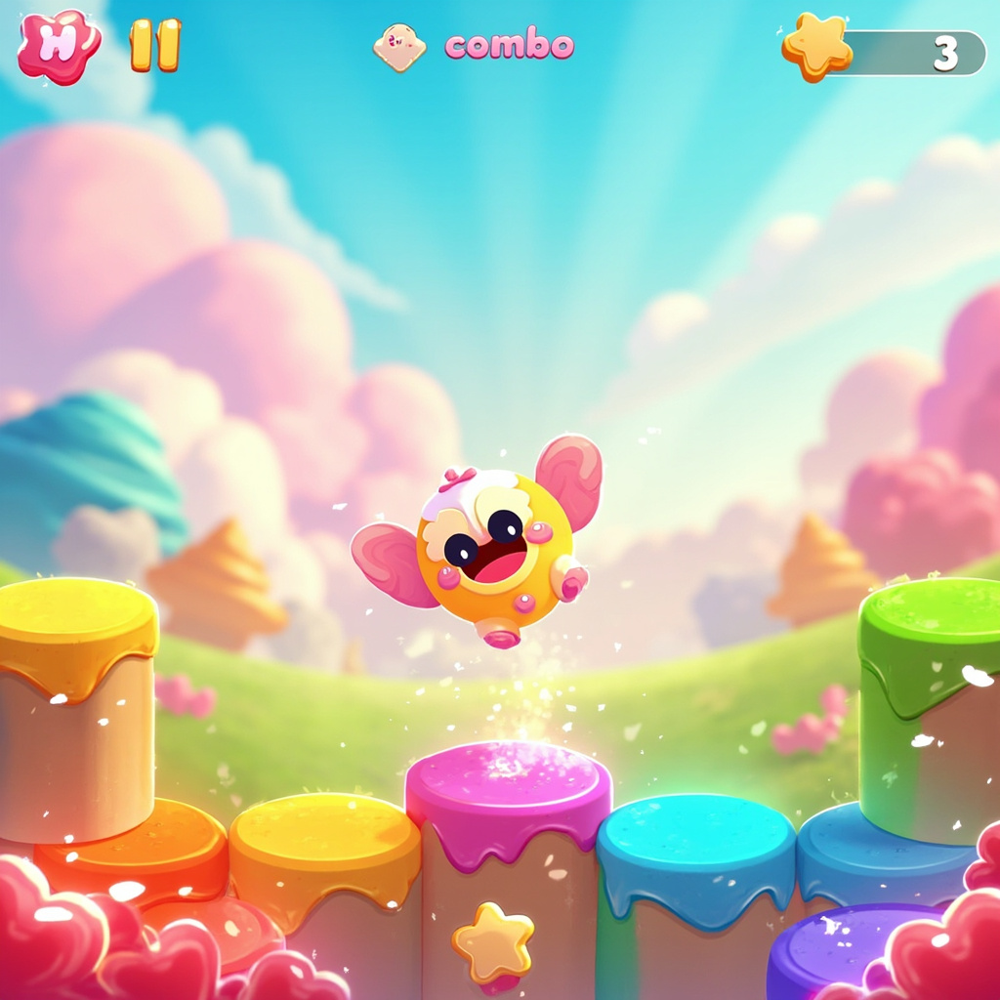

# Color Catch - 糖果跳跳乐 🍬

> A candy-colored vertical platformer. Match colors to score, ride the combo wave!



---

## 🎮 Gameplay

Control a cute candy creature jumping up through an endless series of colorful platforms.

- **Match colors** — Jump onto platforms with the **same color** as you to score points
- **Build combos** — Chain matches quickly for score multipliers
- **Orange = Bonus** — Golden platforms award 3× points + sparkle effects
- **Miss = Game Over** — Landing on a different color ends your run

### Controls

| Input | Action |
|-------|--------|
| `← →` / `A D` | Move left / right |
| `Space` / Click / Tap | Jump (when on ground) |
| Touch drag | Move horizontally |

---

## 🛠️ Tech Stack

| Layer | Technology |
|-------|------------|
| Renderer | HTML5 Canvas 2D |
| Build tool | Vite 5 |
| Language | Vanilla JS (ES Modules) |
| Audio | Web Audio API (synthesized SFX, no external files) |
| Styling | Vanilla CSS |

---

## 🚀 Quick Start

### Prerequisites
- Node.js ≥ 18

### Install & Run

```bash
# Clone the repo
git clone https://github.com/chinazll/colorcatch.git
cd colorcatch

# Install dependencies
npm install

# Start dev server (http://localhost:3000)
npm run dev

# Build for production
npm run build
```

The production build outputs to `dist/`.

---

## 📁 Project Structure

```
colorcatch/
├── index.html              # Entry HTML
├── package.json            # npm config
├── vite.config.js          # Vite build config
├── src/
│   ├── main.js             # App entry
│   ├── style.css           # UI overlay styles
│   ├── game/
│   │   ├── Game.js         # Main game orchestrator & loop
│   │   ├── Player.js       # Player entity, color system
│   │   ├── Platform.js     # Platform + floating ColorBall
│   │   ├── Particle.js     # Particle system, ScorePopup
│   │   └── levels.js       # 10-level difficulty configs
│   ├── render/
│   │   ├── Background.js   # 3-layer parallax background
│   │   ├── Effect.js       # Screen shake controller
│   │   └── HUD.js          # Score, combo, level display
│   └── utils/
│       ├── easing.js       # outBack / outBounce / outElastic
│       ├── audio.js        # Web Audio synthesizer (jump, score, combo, gameover...)
│       └── utils.js        # Color helpers, roundRect, drawStar
└── public/
    └── screenshots/        # Game screenshots for docs
```

---

## 🎨 Features

- **6 candy colors** with matching/gravity core mechanic
- **4 platform types**: normal, crumbling, moving, bonus
- **Combo system** with 2-second timeout and multiplier
- **Q弹动画** — outBack / outBounce / outElastic spring curves on player, platforms, particles
- **3-layer parallax background** (clouds, hills, grass)
- **Synthesized SFX** via Web Audio API — no audio files needed
- **Progressive difficulty** across 10 internal levels
- **Touch + keyboard** input support
- **Screen shake** on big combos
- **High-score tracking** via combo peak display

---

## 🔊 Audio

All sounds are synthesized in real-time using the Web Audio API:

| Event | Description |
|-------|-------------|
| `jump` | Rising pitch sweep |
| `land` | Soft thud + noise pop |
| `score` | Ascending C-E-G ding |
| `combo` | Extended sparkle arpeggio |
| `bonus` | Magical multi-harmonic sparkle |
| `gameover` | Descending sad tones + noise |

---

## 📄 License

MIT — © 2026 chinazll

---

## 🔗 Links

- **GitHub:** https://github.com/chinazll/colorcatch
- **Live Demo:** https://chinazll.github.io/colorcatch
